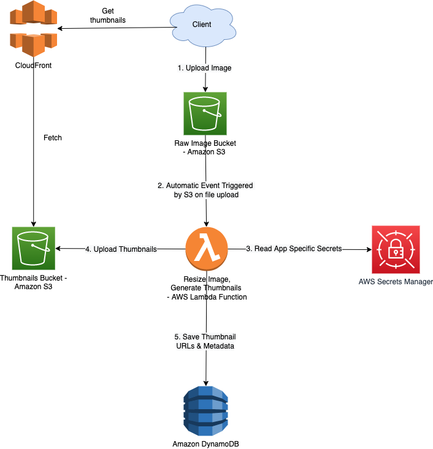

# Use Cases - System Designs

# Design Scalable System on AWS

[Read more](DesignScalableSystemWithRDMS/Readme.md)

# Design Multi-Region Active-Active Architecture On AWS

[Read more](DesignMultiRegionActiveActiveArchitecture/Readme.md)

# Bookstore app on AWS

[Read more](BookStoreSampleApp/Readme.md)

# Modern Data Architecture on AWS

[Read more](../10_BigData)

# Click Stream Analytics on AWS

[Read more](ClickStreamAnalytics/Readme.md)

# Upload Image using Amazon S3 and Lambda

[Read more](DesignUploadImageLambdaS3/Readme.md)

# Others
- [Send-SMS-API design - App Internal Clients, Multiple SMS-Providers, AutoScaling](TransactionSMSDesign/Readme.md)
- [WP Site with Amazon CloudFront & S3](WebsiteSiteUsingCloudFront&S3.md)
- [Dropbox Saves Millions by Building a Scalable Metadata Store on Amazon DynamoDB and Amazon S3](https://github.com/Anshul619/Tech-Stacks-Live-Apps/tree/main/Dropbox/Readme.md)