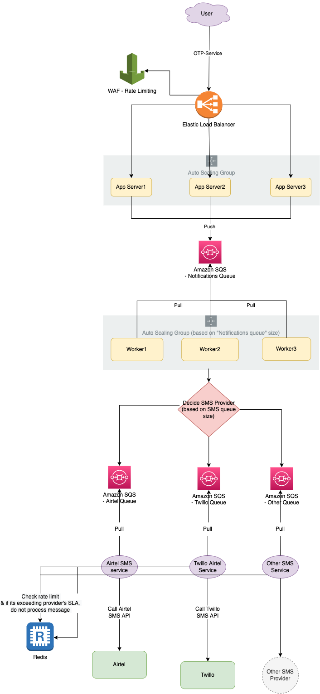

# Transaction SMS - System Design
- Let's design `Send-SMS` api which sends transaction SMS (like OTP) to the users.

# Tech Stack

| Tech Stack                                                                                                            |
|-----------------------------------------------------------------------------------------------------------------------|
| [AWS AutoScaling Group](../../5_AutoScaling/Readme.md)                                                                |
| [AWS AutoScaling based on SQS Queue Size](../../5_AutoScaling/ScalingPolicies/SQSBasedScalingPolicy.md)               |
| [Elastic Load Balancing](../../16_NetworkingAndContentDelivery/2_ApplicationNetworking/ElasticLoadBalancer/Readme.md) |
| [Amazon SQS](../../4_MessageBrokers/AmazonSQS/Readme.md)                                                              |
| [Elastic Cache/Redis](../../1_Databases/AmazonElasticCache/Readme.md)                                                 |

# How would we implement rate limiting of the 3rd party SMS providers? (& follow their SLA)
- We would need to rate limit on our end, before calling 3rd-party API (which might have a limit in their SLA).
- We can achieve this either by using [Redis](../../1_Databases/AmazonElasticCache/Readme.md) (for distributed system) or we can check the current processing queue size to handle this.

# References
- Asked in GoGroup interview, 22-June-2022