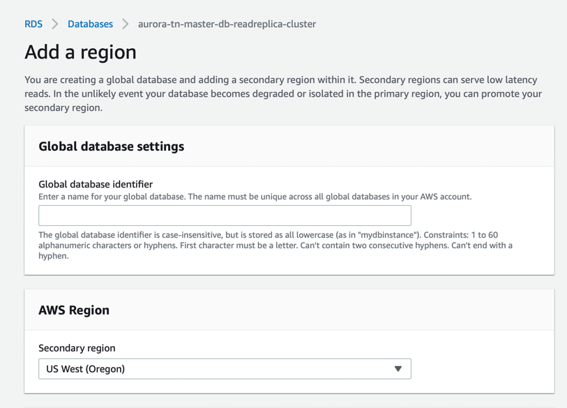
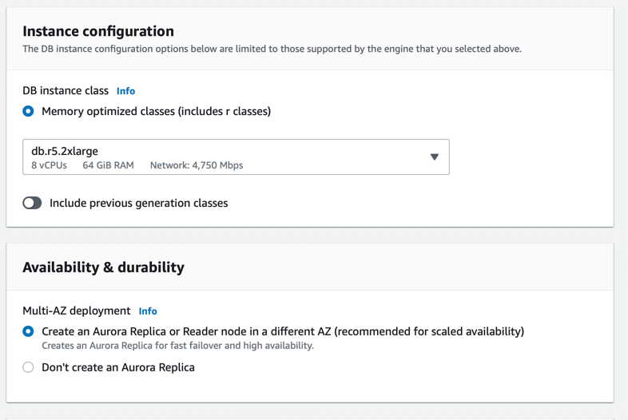
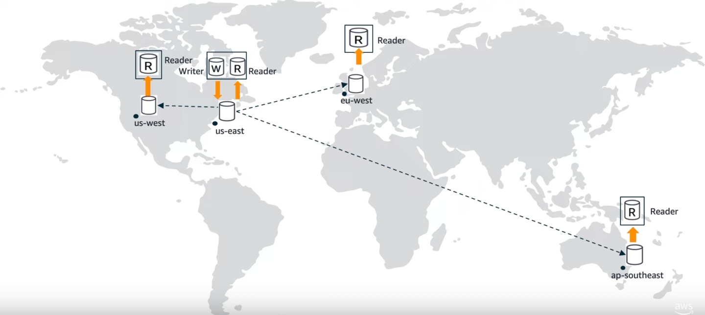

# Aurora Global Database
- [Amazon Aurora global databases](https://docs.aws.amazon.com/AmazonRDS/latest/AuroraUserGuide/aurora-global-database.html) span multiple AWS Regions, enabling low latency global reads and providing fast recovery from the rare outage that might affect an entire AWS Region. 
- [An Aurora global database]() has a primary [Aurora DB cluster](Readme.md) in one Region, and [up to five secondary Aurora DB clusters](Readme.md) in different Regions.
- [Only Single-Master Aurora cluster is supported](https://docs.aws.amazon.com/AmazonRDS/latest/AuroraUserGuide/aurora-multi-master.html) in Aurora Global Database i.e. there would be only 1 writer instance and multiple read replicas in different regions.

# Primary vs Secondary DB Cluster

# How to set up Aurora Global Database?
- Select Aurora DB Cluster and click on [Add Region](https://docs.aws.amazon.com/AmazonRDS/latest/AuroraUserGuide/aurora-global-database-getting-started.html#aurora-global-database-attaching).

# :thumbsup: Advantages of Aurora Global Database

| Advantage                                                                                                              | Description                                                                                                                                                                                                                                                       |
|------------------------------------------------------------------------------------------------------------------------|-------------------------------------------------------------------------------------------------------------------------------------------------------------------------------------------------------------------------------------------------------------------|
| [Sub-Second Data Access in Any Region](https://aws.amazon.com/rds/aurora/global-database/)                             | [Data Locality]() brings data closer to users in different regions to enable faster reads.                                                                                                                                                                        |
| [Cross-Region Replication with low replica lag (in less than 1 second)](../../../AWS-Global-Architecture-Region-AZ.md) | [Aurora uses physical, log-based asynchronous replication](../../../../HLD-System-Designs/3_Databases/5_Database-Internals/AppendOnlyProperty.md)                                                                                                              |
| [Cross-Region Disaster Recovery](https://aws.amazon.com/rds/aurora/global-database/)                                   | [Disaster Recovery](../../../../HLD-System-Designs/7a_HighAvailability/FaultTolerance.md) promotes remote databases to a primary for faster recovery (in less than 1 min) in the event of a disaster. For industries like `Financial Services` etc. |

# Using write forwarding in an Amazon Aurora global database

[Read more](https://docs.aws.amazon.com/AmazonRDS/latest/AuroraUserGuide/aurora-global-database-write-forwarding.html)
