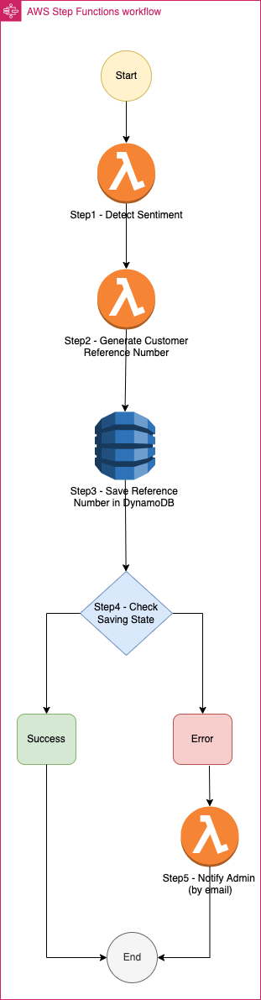

# AWS Lambda
- [AWS Lambda](https://aws.amazon.com/lambda/) is a compute service that lets you run code without provisioning or managing servers. 
- AWS Lambda runs your code on a [high-availability compute infrastructure](../../../HLD-System-Designs/7a_HighAvailability/Readme.md) and performs all the administration of compute resources, including server and operating system maintenance, capacity provisioning and automatic scaling, code monitoring and logging. 
- With Lambda, you can run code for virtually any type of application or backend service, including data processing, real-time stream processing, machine learning, WebSockets, IoT backends, mobile backends, and web apps, like your corporate directory app!

# Lambda Features

| Feature                                                                                                                             | Remarks                                                                                                                                                                                                                                                                                                                                                                                                                                                                                                                                                         |
|-------------------------------------------------------------------------------------------------------------------------------------|-----------------------------------------------------------------------------------------------------------------------------------------------------------------------------------------------------------------------------------------------------------------------------------------------------------------------------------------------------------------------------------------------------------------------------------------------------------------------------------------------------------------------------------------------------------------|
| [Stateless](https://github.com/Ebazhanov/linkedin-skill-assessments-quizzes/blob/main/aws/aws-quiz.md)                              | [Lambda is stateless](https://github.com/Ebazhanov/linkedin-skill-assessments-quizzes/blob/main/aws/aws-quiz.md), so it won't remember who a user is in between requests.                                                                                                                                                                                                                                                                                                                                                                                       |
| [Invocation Methods & Triggers](AWSLambdaInvocationMethods.md)                                                                      |                                                                                                                                                                                                                                                                                                                                                                                                                                                                                                                                                                 |
| [Destinations - On success or error](AWSLambdaDestinations.md)                                                                      |                                                                                                                                                                                                                                                                                                                                                                                                                                                                                                                                                                 |
| [Test locally using AWS SAM CLI](../../0_ServerlessArchitecture/SAM.md)                                                            | [AWS SAM CLI](../../0_ServerlessArchitecture/SAM.md) can be used to test the Lambda function locally.                                                                                                                                                                                                                                                                                                                                                                                                                                                          |
| [Function blueprints](https://docs.aws.amazon.com/lambda/latest/dg/gettingstarted-features.html#gettingstarted-features-blueprints) | When you create [a function](AWSLambdaFunctionHandler.md) in the Lambda console, you can choose to start from scratch, [use a blueprint](https://docs.aws.amazon.com/lambda/latest/dg/gettingstarted-features.html), or use a container image. - A blueprint provides sample code that shows how to use Lambda with an AWS service or a popular third-party application. - Blueprints include sample code and function configuration presets for Node.js and Python runtimes.                                                                           |
| [IAM Permissions](AWSLambdaFunctionPermissions.md)                                                                                  |                                                                                                                                                                                                                                                                                                                                                                                                                                                                                                                                                                 |
| [Scaling Considerations](AWSLambdaScaling.md)                                                                                       |                                                                                                                                                                                                                                                                                                                                                                                                                                                                                                                                                                 |
| Encryption at rest                                                                                                                  | [Lambda Handler](AWSLambdaFunctionHandler.md), [Layer](https://docs.aws.amazon.com/lambda/latest/dg/invocation-layers.html), [Environment Variables](https://docs.aws.amazon.com/lambda/latest/dg/configuration-envvars.html) are stored encrypted.                                                                                                                                                                                                                                                                                                             |
| [Networking](AWSLambdaNetworking.md)                                                                                                | Lambda functions always operate from an AWS-owned VPC.                                                                                                                                                                                                                                                                                                                                                                                                                                                                                                          |
| Billing granularity                                                                                                                 | You are charged for the number of times your code is triggered (requests) and for the time your code executes, rounded up to the nearest 1 ms (duration). - It can be cost effective to run functions whose execution time is very low, such as functions with durations under 100 ms or low latency APIs. [aws-lambda-power-tuning](https://serverlessrepo.aws.amazon.com/applications/arn:aws:serverlessrepo:us-east-1:451282441545:applications~aws-lambda-power-tuning) can be helpful for lambda billing estimation (to balance power & duration). |
| [Tags](https://docs.aws.amazon.com/lambda/latest/dg/configuration-tags.html)                                                        | You can tag AWS Lambda functions to activate attribute-based access control (ABAC) and to organize them by owner, project, or department.  - Tags are free-form key-value pairs that are supported across AWS services for use in ABAC, filtering resources, and adding detail to billing reports.                                                                                                                                                                                                                                                          |
| [Processor Architecture - ARM vs x86](https://aws.amazon.com/lambda/pricing/)                                                       | ARM processor is bit cheaper than x86 processor                                                                                                                                                                                                                                                                                                                                                                                                                                                                                                                 |
| [Schedule expressions using rate or cron](https://docs.aws.amazon.com/lambda/latest/dg/services-cloudwatchevents-expressions.html)  | AWS Lambda supports standard rate and cron expressions for frequencies of up to once per minute.  - [EventBridge](../../4_MessageBrokers/AmazonEventBridge.md) rate expressions are simpler to define but do not offer the fine-grained schedule control that cron triggers support.                                                                                                                                                                                                                                             |

# Supported Configuration

| Config                                                                              | Type                 | Limit       | Remarks                                                                                                                                                                               |
|-------------------------------------------------------------------------------------|----------------------|-------------|---------------------------------------------------------------------------------------------------------------------------------------------------------------------------------------|
| :star: Memory                                                                       | General              | -           | Example - 512 MB  - Over provision memory to run your functions faster and reduce your costs (since cost is calculated based on compute time).                                    |
| :star: Timeout                                                                      | General              | Max 15 mins | Example - 20 sec  - Do not over-provision your function timeout settings. - If its greater than 15 mins, [AWS Step Functions](../AWSStepFunctions/Readme.md) might be better choice. |
| Ephemeral storage                                                                   | General              | -           | Example - 512 MB                                                                                                                                                                      |
| Batch Size                                                                          | General              | 1 to 10     | Number of messages that can be in a batch                                                                                                                                             |
| Number of default pollers (batches returned at one time)                            | General              | 5           | -                                                                                                                                                                                     |
| [Lambda Handler](AWSLambdaFunctionHandler.md)                                       | Code                 | No limit    | -                                                                                                                                                                                     |
| [Lambda layer](https://docs.aws.amazon.com/lambda/latest/dg/invocation-layers.html) | Code                 | No limit    | A Lambda layer is a .zip file archive that can contain additional code or other content, like libraries, config files etc.                                                            |
| [AWS KMS key](../../17_Security/1_DataProtection/AWSKMS.md)         | Environment Variable | -           | -                                                                                                                                                                                     |

# :star: Real world use cases of AWS Lambda

## Upload Image using Amazon S3 and Lambda

[Read more](../../../HLD-System-Designs/0_HLDUseCasesProblems/AWS_DesignUploadImageLambdaS3/Readme.md)

## Design Scalable System on AWS

[Read more](../../../HLD-System-Designs/0_HLDUseCasesProblems/AWS_DesignScalableSystemWithRDMS/Readme.md)

## Bookstore app on AWS

[Read more](../../../HLD-System-Designs/0_HLDUseCasesProblems/AWS_BookStoreSampleApp/Readme.md)

## Amazon SNS with Lambda

[Read more](../../4_MessageBrokers/AmazonSNS.md)

## AWS Step Functions with Lambda

[Read more](../AWSStepFunctions/Readme.md)

## Event Driven Architecture
- [AWS Lambda]() is an example of an [event-driven architecture](../../../HLD-System-Designs/4_MessageBrokersEDA/EventDrivenArchitecture/Readme.md).
- Most AWS services generate events and act as an event source for Lambda.
- Lambda runs custom code (functions) in response to events.
- Lambda functions are designed to process these events and, once invoked, may initiate other actions or subsequent events.

## Others
- Backup Jobs - Lambda can be used to configure backup scripts for the application.
- Automatic Jobs - Shutdown AWS resources at certain time.

# Monitoring & Troubleshooting

| Feature                                                                                                                                                          | Description                                                                                                                                                                                                                                                                                                                                                                                                                                                                                                                                                      |
|------------------------------------------------------------------------------------------------------------------------------------------------------------------|------------------------------------------------------------------------------------------------------------------------------------------------------------------------------------------------------------------------------------------------------------------------------------------------------------------------------------------------------------------------------------------------------------------------------------------------------------------------------------------------------------------------------------------------------------------|
| [Tracing of Lambda using AWS X-Ray](../../8_ObservabilityLogs/AWSXRay.md)                                                                                       | [AWS X-Ray](../../8_ObservabilityLogs/AWSXRay.md) can be used to trace Lambda code. - You can use AWS X-Ray to visualize the components of your application, identify performance bottlenecks, and troubleshoot requests that resulted in an error.                                                                                                                                                                                                                                                                                                         |
| [Logging Lambda API calls with CloudTrail](https://docs.aws.amazon.com/lambda/latest/dg/logging-using-cloudtrail.html)                                           | [AWS Cloudtrail](../../8_ObservabilityLogs/AWSCloudTrail.md) can be used to monitor invocations of Lambda functions.                                                                                                                                                                                                                                                                                                                                                                                                                                            |
| [Lambda logging](https://docs.aws.amazon.com/lambda/latest/dg/python-logging.html) (stored in [CloudWatch Logs](../../8_ObservabilityLogs/AmazonCloudWatch/Readme.md)) | Lambda logs all requests handled by your function and automatically stores logs generated by your code through [Amazon CloudWatch Logs](../../8_ObservabilityLogs/AmazonCloudWatch/Readme.md).  - To validate your code, instrument it with custom logging statements.                                                                                                                                                                                                                                                                                             |

# Tools

| Tool                                                                                | Description                                                                                                                                                              |
|-------------------------------------------------------------------------------------|--------------------------------------------------------------------------------------------------------------------------------------------------------------------------|
| [AWS Lambda Power Tuning](https://github.com/alexcasalboni/aws-lambda-power-tuning) | AWS Lambda Power Tuning is a state machine powered by AWS Step Functions that helps you optimize your Lambda functions for cost and/or performance in a data-driven way. |

# Reference
- [AWS Lambda (The Heart of Serverless)](https://rochisha-jaiswal70.medium.com/aws-lambda-the-heart-of-serverless-9a5cdcb6e27c)
- [Invoking Lambda functions](https://docs.aws.amazon.com/lambda/latest/dg/lambda-invocation.html)
- [AWS Fargate vs. Lambda: Comparing Two Serverless Solutions and their Use Cases](https://www.simform.com/blog/aws-fargate-vs-lambda/)
- [Operating Lambda: Understanding event-driven architecture – Part 1](https://aws.amazon.com/blogs/compute/operating-lambda-understanding-event-driven-architecture-part-1/)
- [Best Practices for Developing on AWS Lambda](https://aws.amazon.com/blogs/architecture/best-practices-for-developing-on-aws-lambda/)
