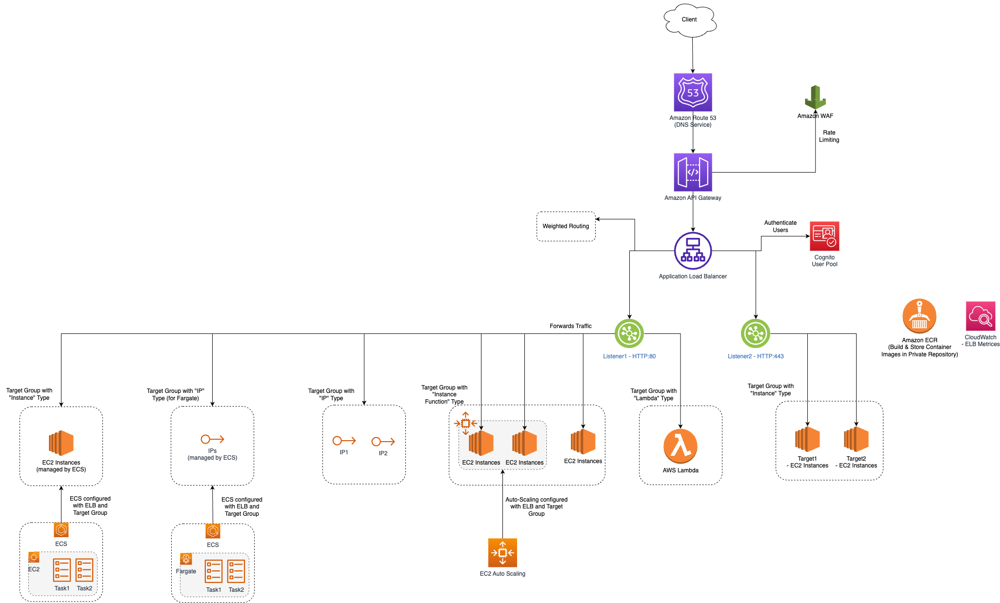

# Amazon EKS - Amazon Elastic Kubernetes Service
- [Amazon Elastic Kubernetes Service (Amazon EKS)](https://aws.amazon.com/eks/) is a managed container service to run and scale [Kubernetes](https://github.com/Anshul619/HLD-System-Designs/blob/main/9_Container&Orchestration/Kubernates/Readme.md) applications in the cloud or on-premises.
- Applications running on Amazon EKS are fully compatible with applications running on any standard [Kubernetes](https://github.com/Anshul619/HLD-System-Designs/blob/main/9_Container&Orchestration/Kubernates/Readme.md) environment, whether running in on-premises data centers or public clouds. 

# Real-world use cases

| Use Case                                                                                         |
|--------------------------------------------------------------------------------------------------|
| [Swiggy](https://bytes.swiggy.com/how-swiggy-migrated-its-k8s-workload-to-graviton-d2643bbc7871) |

# Components

| Component             | AWS Service                                                                                                                                                                                                                                                                                                         |
|-----------------------|---------------------------------------------------------------------------------------------------------------------------------------------------------------------------------------------------------------------------------------------------------------------------------------------------------------------|
| Networking            | EKS infrastructure uses [Amazon Virtual Private Cloud (VPC)](../16_NetworkingAndContentDelivery/3_NetworkFoundationsVPC/Readme.md) to provide networking between the Kubernetes control plane and worker nodes.                                                                                                      |
| Load balancing        | EKS uses [AWS Elastic Load Balancer (ELB)](../16_NetworkingAndContentDelivery/2_ApplicationNetworking/ElasticLoadBalancer/Readme.md) to distribute traffic between worker nodes.                                                                                                                                     |
| Storage               | EKS supports a variety of storage options, including [Amazon Elastic Block Store (EBS)](../6_FileStorages/1_BlockStorageTypes/AmazonEBS/Readme.md), [Amazon Elastic File System (EFS)](../6_FileStorages/2_FileStorageTypes/AmazonEFS.md), and [Amazon S3](../6_FileStorages/3_S3ObjectStorage/Readme.md). |
| Control Plane         | The [EKS control plane](https://docs.aws.amazon.com/eks/latest/userguide/clusters.html) manages the Kubernetes API server and other components required to run Kubernetes on AWS.                                                                                                                                   |
| Worker Nodes          | Either [Amazon EC2](../2_Compute/AmazonEC2/Readme.md) or [AWS Fargate](../2_Compute/AWSFargate.md) can be used as worker nodes.                                                                                                                                                                     |
| Permission Management | [AWS Identity and Access Management (IAM)](../7_IdentityManagement/AWSIAM/Readme.md) is used to manage access to the EKS control plane and worker nodes.                                                                                                                                                             |
| Cluster Autoscaler    | The Kubernetes [Horizontal Pod Autoscaler](https://docs.aws.amazon.com/eks/latest/userguide/horizontal-pod-autoscaler.html) automatically scales the number of Pods in a deployment, replication controller, or replica set based on that resource's CPU utilization.                                               |

# Modular and Scalable Amazon EKS Architecture on AWS

[Read more](https://aws.amazon.com/quickstart/architecture/amazon-eks/)

# Amazon EKS Types

|             | EKS                                                                                      | EKS-Anywhere                                                                                                                                         | EKS-Distro                                                                                                                                        |
|-------------|------------------------------------------------------------------------------------------|------------------------------------------------------------------------------------------------------------------------------------------------------|---------------------------------------------------------------------------------------------------------------------------------------------------|
| Description | EKS is a fully managed Kubernetes service that is designed to run on AWS infrastructure. | EKS-A, on the other hand, is a hybrid offering that enables users to run EKS-managed Kubernetes clusters on-premises or in other cloud environments. | EKS-Distro is an open-source Kubernetes distribution that can be run on any infrastructure, including on-premises or in other cloud environments. |

[Read more](https://www.upnxtblog.com/index.php/2023/04/24/understanding-the-differences-between-amazon-eks-eks-anywhere-and-eks-distro-which-solution-is-right-for-your-business/)

# References
- [Containers on AWS Overview: ECS | EKS | Fargate | ECR](https://www.youtube.com/watch?v=AYAh6YDXuho)
- [Implementing Microservices on AWS](https://docs.aws.amazon.com/whitepapers/latest/microservices-on-aws/microservices.html)
- [EKS cluster for EC2 instances - Cloudformation template](../9_InfrastructureAsCode/AWSCloudFormation/sample_templates/EKS_ECS.yml)
- [How to build a AWS EKS infrastructure?](https://medium.com/@brunorodrigueslopes/how-to-build-a-aws-eks-infrastructure-f4abc080710f)