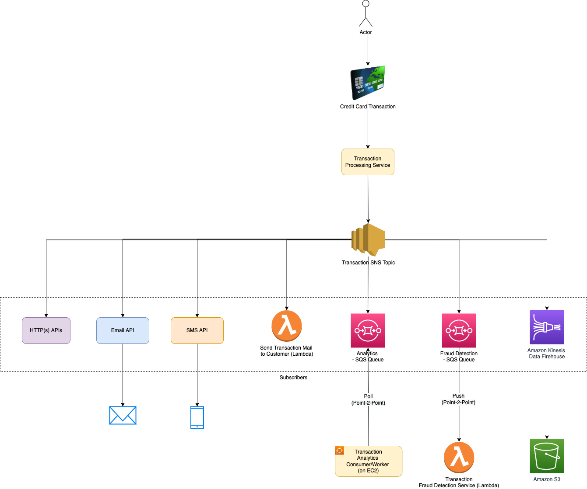
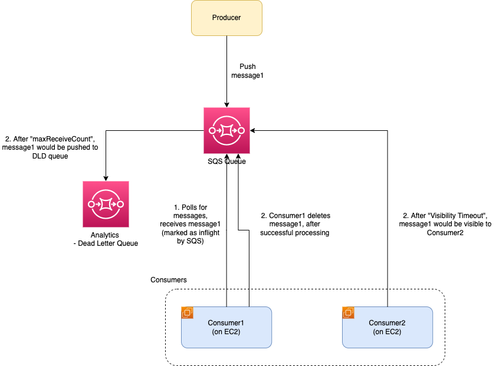

# Amazon SQS (Simple Queue Service)
- [Amazon SQS (Simple Queue Service)](https://aws.amazon.com/sqs/) is a fully managed message queuing service that enables you to [decouple and scale microservices](https://github.com/Anshul619/HLD-System-Designs/blob/main/7_ArchitecturePatterns/EventDrivenArchitecture/Readme.md), [distributed systems](https://github.com/Anshul619/HLD-System-Designs/blob/main/4_Scalability), and [serverless applications](../../13_ServerlessArchitecture/Readme.md).
- :star: [Amazon SQS vs others](https://github.com/Anshul619/HLD-System-Designs/blob/main/2_MessageBrokersEDA/KafkaVsRabbitMQVsSQSVsSNS.md)  

# Key Features

| Feature                                                                                                                                   | Descriptions                                                                                                                                                                                                                                                                                                                                                                                                                                                                                          |
|-------------------------------------------------------------------------------------------------------------------------------------------|-------------------------------------------------------------------------------------------------------------------------------------------------------------------------------------------------------------------------------------------------------------------------------------------------------------------------------------------------------------------------------------------------------------------------------------------------------------------------------------------------------|
| Highly Available                                                                                                                          | [Amazon SQS]() is [highly available](https://github.com/Anshul619/HLD-System-Designs/blob/main/5_HighAvailability/Readme.md), by default.                                                                                                                                                                                                                                                                                                                                                                                                             |
| At-least-Once delivery                                                                                                                    | Unlike a [publish-subscribe system](https://github.com/Anshul619/HLD-System-Designs/blob/main/7_ArchitecturePatterns/EventDrivenArchitecture/PubSubModel.md), a single message should be delivered to a single consumer, even when there are a lot of consumers running concurrently.                                                                                                                                                                                                                                                                     |
| Dead-Letter Queue                                                                                                                         | [Read more](DLQ.md)                                                                                                                                                                                                                                                                                                                                                                                                                                                                                   |
| [Visibility Timeout](https://docs.aws.amazon.com/AWSSimpleQueueService/latest/SQSDeveloperGuide/sqs-visibility-timeout.html)              | [Visibility timeout](https://docs.aws.amazon.com/AWSSimpleQueueService/latest/SQSDeveloperGuide/sqs-visibility-timeout.html) is a period during which Amazon SQS prevents other consumers from receiving and processing a given message.                                                                                                                                                                                                                                                              |
| Message payload limit                                                                                                                     | Max message payload can be 256KB in SQS queue.                                                                                                                                                                                                                                                                                                                                                                                                                                                        |
| [Short & long polling](ShortLongPoling.md)                                                                                             | [Amazon SQS](https://aws.amazon.com/sqs/faqs/) provides short polling and long polling to receive messages from a queue.                                                                                                                                                                                                                                                                                                                                                                              |
| In-flight Messages Limit                                                                                                                  | 120,000 for a standard queue, 20,000 for a FIFO queue. - [Messages are inflight](https://aws.amazon.com/premiumsupport/knowledge-center/sqs-message-backlog/) after they have been received from the queue by a consuming component, but have not yet been deleted from the queue.                                                                                                                                                                                                                |
| [Batch Actions](https://docs.aws.amazon.com/AWSSimpleQueueService/latest/SQSDeveloperGuide/sqs-batch-api-actions.html)                    | Max 10 batches (i.e. max 10 messages per operation)                                                                                                                                                                                                                                                                                                                                                                                                                                                   |
| [GroupID / MessageGroupId](https://docs.aws.amazon.com/AWSSimpleQueueService/latest/SQSDeveloperGuide/using-messagegroupid-property.html) | [MessageGroupId](https://docs.aws.amazon.com/AWSSimpleQueueService/latest/APIReference/API_SendMessage.html) is the tag that specifies that a message belongs to a specific message group.  - Messages that belong to the same message group are always processed one by one, in a strict order relative to the message group (however, messages that belong to different message groups might be processed out of order).                                                                        |
| [Delay queues](https://docs.aws.amazon.com/AWSSimpleQueueService/latest/SQSDeveloperGuide/sqs-delay-queues.html)                          | [Delay queues](https://docs.aws.amazon.com/AWSSimpleQueueService/latest/SQSDeveloperGuide/sqs-delay-queues.html) let you postpone the delivery of new messages to consumers for a number of seconds (known as [message timer](https://docs.aws.amazon.com/AWSSimpleQueueService/latest/SQSDeveloperGuide/sqs-message-timers.html)), for example, when your consumer application needs additional time to process messages. - The maximum delay can be 15 minutes.                                 |
| Priority of work                                                                                                                          | Use separate queues to provide prioritization of work.                                                                                                                                                                                                                                                                                                                                                                                                                                                |
| [Temporary Queues](https://aws.amazon.com/blogs/compute/simple-two-way-messaging-using-the-amazon-sqs-temporary-queue-client/)            | The [Temporary Queue client](https://docs.aws.amazon.com/AWSSimpleQueueService/latest/SQSDeveloperGuide/sqs-temporary-queues.html) maps multiple temporary queues—application-managed queues created on demand for a particular process—onto a single Amazon SQS queue automatically. - Virtual queues let you multiplex many low-traffic queues onto a single SQS queue, helpful for [point-2-point message pattern](https://github.com/Anshul619/HLD-System-Designs/blob/main/7_ArchitecturePatterns/EventDrivenArchitecture/PointToPointModel.md). |
| [Standard vs FIFO Queues](StandardVsFIFOQueues.md)                                                                                        |                                                                                                                                                                                                                                                                                                                                                                                                                                                                                                       |

# Amazon SQS Dead-letter queue

# Amazon SQS delay queues

# References
- [Amazon's SQS performance and latency](https://softwaremill.com/amazon-sqs-performance-latency/)
- [SQS vs SNS vs Amazon MQ - Comparison - AWS Certification Cheat Sheet](https://cloud.in28minutes.com/aws-certification-sqs-vs-sns-vs-amazon-mq)
- [Solving Complex Ordering Challenges with Amazon SQS FIFO Queues](https://aws.amazon.com/blogs/compute/solving-complex-ordering-challenges-with-amazon-sqs-fifo-queues/)